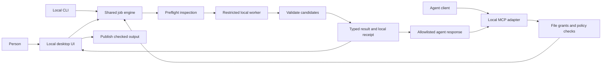

# Architecture and migration

Status: proposed design, not an implemented API. See [requirements](PRODUCT_REQUIREMENTS.md), [tasks](TASKS.md), and [validation](VALIDATION.md).

## 1. Current state and required changes

Source baseline: [`82ab79e`](https://github.com/nani1902/CHONK/tree/82ab79e9870ecb6246f88a327843ad97ab4a6193). Findings below come from source inspection, not a runtime security audit or performance benchmark.

| Area | Current implementation | Required end state |
|---|---|---|
| Entrypoint | `pdf_compressor.py:run()` takes an argparse namespace and returns an integer | Typed engine request/result independent of CLI or UI |
| Desktop | `app.py` calls `run()` in a daemon thread and redirects process-global stdout/stderr into a queue | UI consumes typed events; worker isolation and cancellation do not depend on log parsing |
| Input inspection | `pdf_page_count()` rejects encryption and empty PDFs | Feature inventory and policy evaluation before rewriting |
| Search | `build_profiles()` creates a ranked ladder; `choose_profiles()` searches endpoints, binary intervals, and neighbors | Bounded search without treating profile ordering as proof of monotonic size/quality |
| Selection | Mean page pixel similarity; first profile may return immediately if it fits | Hard checks first, then calibrated page/region quality evidence; a documented fast path is allowed only after validation |
| Validation | PDF parse, page count, render comparison, and final byte ceiling | Page geometry/order, text comparison, supported feature preservation, explicit unknown results, local evidence |
| Privacy | No upload/telemetry path in reviewed processing code; CLI prints local paths and raw failure diagnostics | Restricted worker execution, scrubbed tool responses, scoped file access, tested egress boundary |
| Temporary data | `TemporaryDirectory` for candidate PDFs and same-directory staged output | Private per-job workspace, deadlines, crash recovery, retention policy, secure permissions |
| Time limit | Timeout applies to each Ghostscript call; rendering/comparison is outside it | Deadline covers the complete job, including inspection and render workers |
| Failure reporting | Most expected CLI errors return exit code 2; GUI can label unrelated failures as failure to meet the limit | Typed causes and consistent recovery guidance |
| Output | Source-path check, temporary staging, final validation, then `os.replace()` | Same safety intent with hard-link/symlink identity checks and race-safe no-clobber publication |
| Already under limit | Compression still runs | Validated unchanged-byte fast path |
| Agent integration | CLI human output only | Versioned JSON CLI and local stdio MCP |
| Batch/review | Single-file GUI with a log | Per-file queue, local side-by-side review, receipts |
| Packaging/tests | Source installation instructions; no test suite or CI in reviewed tree | Reproducible builds, synthetic test fixtures, platform checks, install verification |

A known search limitation is the early failure when the presumed lowest-fidelity endpoint exceeds the target. Size need not be monotonic, so this does not establish that all profiles fail. Likewise, the returned `smallest` value should always be the minimum over actual tested candidates. Cover both behaviors with regression tests during migration.

## 2. Target structure

Keep Python and the existing compression dependencies initially. Preserve the public source launchers during migration. Suggested modules are responsibilities, not a requirement to create empty files in advance.

```text
app.py                         # compatibility desktop launcher
pdf_compressor.py              # compatibility CLI launcher
pyproject.toml                 # packaging, supported Python, entrypoints
src/chonk/
  models.py                    # requests, results, events, errors
  engine.py                    # inspect -> search -> verify orchestration
  inspection.py                # feature inventory and capabilities
  policies.py                  # versioned hard/advisory constraints
  search.py                    # candidate budget and selection
  backends/ghostscript.py      # fixed allowlisted invocation
  validation/structure.py
  validation/text.py
  validation/visual.py
  runtime/worker.py            # process isolation and resource controls
  runtime/files.py             # grants, identities, safe output publication
  runtime/jobs.py              # jobs, idempotency, cancellation, queue
  runtime/receipts.py          # local evidence and response redaction
  adapters/cli.py
  adapters/mcp.py
  ui/app.py
  ui/review.py
tests/
  fixtures/                   # generated/synthetic documents only
  unit/
  integration/
  security/
  contracts/
```



The engine must not depend on Tkinter, argparse, MCP, or stdout formatting. Backends must not decide product policy. Validation must inspect actual output bytes rather than infer success from selected Ghostscript flags.

## 3. Processing algorithm

1. Validate request schema, policy version, deadline, and file/output grants.
2. Bind the granted source to a stable local file identity and create a private snapshot for the job where necessary. Hashes stay local by default. Detect source changes rather than mixing revisions.
3. Inspect in a bounded worker. Inventory page geometry, text-layer presence, document features, and parsing confidence.
4. Evaluate policy. Unsupported or unknown required features stop processing with actionable reasons.
5. If the source already meets the target and policy, validate it as an unchanged result. Preserve the exact bytes in a new output only if requested.
6. Search candidates within total deadline, attempt, memory, scratch-space, page-count, and pixel budgets. Reject malformed candidates; distinguish a candidate failure from a fatal backend/environment failure.
7. Run structural and policy checks. An output that loses required content is ineligible regardless of size or visual score.
8. Compare eligible candidates by page and useful regions, retaining worst-page evidence. No universal numeric visual threshold is prescribed here; calibrate thresholds against labeled fixtures before enabling automatic readiness.
9. Select the best tested eligible result that fits. Use deterministic tie-breaking for identical evidence. Do not promise a globally optimal result or identical output bytes across backend versions.
10. Return a ready, review, or failure outcome with check results. Pending-review artifacts remain private and are not returned as exportable output handles.
11. Before publishing, verify the selected artifact identity, final byte ceiling, and required checks again as necessary to ensure the published bytes are the checked bytes.
12. Clean scratch artifacts after publication/cancellation/failure, except pending review artifacts under the explicit retention policy.

Text comparison should normalize only documented differences, such as line-ending representation; aggressive normalization can hide changed numbers. Extracted-text equivalence is a useful check, not proof of glyph correctness, reading order, or scan readability. Different extractions that cannot be reconciled are review cases or hard failures according to policy. An empty extraction must not be interpreted as successful text preservation.

## 4. Policies and outcome semantics

Initial policies:

- `preserve-existing-text-v1`: supported ordinary PDFs; preserve existing text where present, page geometry/order, and supported document features. Image-only pages are explicitly identified and use the scan review rules.
- `require-searchable-v1`: requires a usable existing text layer on every relevant content page, with documented handling of blank pages. Scans without text are blocked; v1 does not add OCR.
- `scan-review-v1`: permits image-only PDFs; structural checks are required, visual uncertainty requires review, and text preservation is explicitly `not_applicable` where no layer exists. Start image-only pilot files in review until visual rules are calibrated.

All policies share unsupported-feature restrictions. Preservation of annotations, links, outlines, or tags must have explicit validators; if not supported in v1, their presence blocks transformation under the strict policy. Do not silently drop features to fit a file size.

Job lifecycle: `queued` → `inspecting` → `processing` → `validating` → a terminal result, or `needs_review`. A review resolution produces a terminal result; `needs_review` is a suspended state, not a background-running job.

| Result status | Meaning | Output access |
|---|---|---|
| `ready` | Required checks passed; advisory uncertainty resolved if needed | Exportable local artifact |
| `needs_review` | Fits the byte limit but has human-resolvable uncertainty | Local preview only |
| `target_not_met` | No tested candidate fits the byte limit within the search budget | No exportable result |
| `blocked` | Unsupported input, denied scope, or violated hard requirement | No exportable result |
| `failed` | Runtime/backend/validation infrastructure failure | No exportable result |
| `cancelled` | Cancelled by user or explicit deadline policy | No exportable result |

Check states: `pass`, `fail`, `unknown`, `not_applicable`. A required `unknown` is never a pass. Report `completion_basis: automated_checks | human_review | unchanged_source` for ready files. Human review may accept only advisory uncertainties, records what was accepted, and never changes a failing size/structure/preservation check into a pass. Rejection cancels the pending result. Review expiry cancels it with `REVIEW_EXPIRED`.

Reason codes include `ENCRYPTED_INPUT`, `SIGNED_INPUT`, `UNSUPPORTED_FEATURE`, `INSPECTION_INCONCLUSIVE`, `SOURCE_CHANGED`, `ACCESS_DENIED`, `TARGET_NOT_MET`, `PRESERVATION_CONSTRAINT_FAILED`, `QUALITY_REVIEW_REQUIRED`, `BACKEND_UNAVAILABLE`, `DEADLINE_EXCEEDED`, `RESOURCE_LIMIT_EXCEEDED`, and `OUTPUT_CONFLICT`. Separate reason codes from localized human messages. Clients should branch on codes, not prose.

## 5. Agent and CLI contract

Implement schema version `1.0` with a shared model/schema source. The following is illustrative proposed syntax, not a working command at the baseline:

```sh
chonk prepare ./statement.pdf --target-size 2MB \
  --policy preserve-existing-text-v1 --json
```

The legacy `python pdf_compressor.py input.pdf --target-size 2MB` remains supported through the adapter. Machine mode emits one final JSON object on stdout; progress is a separate opt-in JSONL stream or stderr. Default human mode stays readable. CLI exit codes: 0 ready, 2 invalid request/blocked, 3 target not met, 4 review required, 5 runtime failure, 130 cancelled. Document this change from the baseline's mostly uniform error code 2.

Proposed MCP tools:

| Tool | Inputs | Result |
|---|---|---|
| `chonk_capabilities` | None | Schema, policy versions, limits, actual privacy-enforcement capability |
| `chonk_inspect` | Granted `file_id`, `policy_id` | Minimal feature flags, support decision, reason codes |
| `chonk_prepare` | File IDs, target bytes per file, policy ID, deadline, idempotency key, granted destination ID | Job ID and accepted request summary |
| `chonk_job_status` | Authorized job ID | Phase/counts or redacted per-file results |
| `chonk_cancel` | Authorized job ID | Cancellation acknowledgement; terminal state available through status |
| `chonk_open_review` | Authorized job ID | Launch local review; return acknowledgement only |

Creating file/destination grants is a local human/host integration function, not an unrestricted agent tool. Opening a review must not allow the agent to approve it. Launching the UI uses fixed local code paths, not an arbitrary URL or shell command.

Example minimal agent result for one completed file; values are synthetic:

```json
{
  "schema_version": "1.0",
  "job_id": "job_example_01",
  "file_id": "file_example_01",
  "status": "ready",
  "reason_codes": [],
  "completion_basis": "automated_checks",
  "policy_id": "preserve-existing-text-v1",
  "target_bytes": 2000000,
  "output_bytes": 1872400,
  "artifact_id": "artifact_example_01",
  "checks": {
    "size_ceiling": "pass",
    "page_structure": "pass",
    "extracted_text": "pass",
    "visual_policy": "pass"
  },
  "limitations": ["Checks do not certify portal acceptance or perfect readability."],
  "next_action": "use_local_artifact"
}
```

The full local receipt also includes per-page evidence, hashes, engine versions, attempted profiles, policy parameters, timestamps, and review decisions. Do not return local paths or hashes to cloud-facing clients by default. IDs authorize nothing on their own: scope each lookup to the current local client/session and grant.

Idempotency is scoped to client, source snapshot, request parameters, and destination grant. The same key/request returns the existing job or result; the same key with different parameters is a conflict. Never trigger duplicate compression or overwrite outputs on transport retries. Expired artifacts are reported as expired rather than silently reused.

## 6. Privacy and security boundary

### Protected assets and threats

Protect document bytes, page renders, extracted text, local paths, output integrity, and access grants. Relevant threats include a malicious PDF exploiting a parser, a model requesting arbitrary paths, accidental log disclosure, stale temporary files, and an output path changed during processing.

The product cannot protect against a compromised operating system, an administrator reading process memory, an unrelated agent with independent filesystem access, or a person deliberately uploading the result elsewhere. Opaque handles minimize disclosure through CHONK; they do not make an agent host trustworthy.

### Enforcement requirements

- Prefer stdio MCP initially; do not open a network listener.
- Bind inputs to allowlisted file grants; reject traversal, symlink/hard-link alias escapes, stale grants, and unauthorized output destinations.
- Run parsers/renderers/compressors with least privilege, no outbound network access, bounded process trees, and limited writable scratch space. Ghostscript `-dSAFER` remains useful but is not the entire OS isolation boundary.
- Pin/test dependency versions for releases and keep an update process. If a supported OS cannot enforce the privacy mode, expose that failure and block that mode; do not report `local_only` based only on intent.
- Use fixed backend arguments. Agents cannot supply Ghostscript program fragments, arbitrary executables, shell commands, or environment overrides.
- Treat all document content and metadata as untrusted data. It must never become agent instructions, policy configuration, executable filenames, or commands.
- Scrub parser and backend diagnostics before tool responses. Keep optional local diagnostics behind explicit local access with the same retention controls.
- Disable automatic network update checks during document-processing sessions. Any future update service operates separately without document access.

### Temporary files and retention

Use private per-job directories with owner-only access or the platform equivalent. Account for candidate PDFs, render caches, text comparisons, and crash leftovers. Clean completed scratch data immediately after publishing; retain local review artifacts for a proposed maximum of 24 hours, configurable downward. Give the user immediate discard and visibly report expiry. Minimize receipt contents and provide local receipt deletion.

Recovery cleanup must validate ownership and job manifests; never recursively delete an arbitrary path supplied by an agent or a tampered manifest. Expiry and restart recovery need tests. Ordinary deletion is not guaranteed secure erasure on modern storage; document that limitation. For stronger requirements, an encrypted workspace can be evaluated later rather than promised prematurely.

## 7. Migration strategy

1. Capture current behavior in generated fixtures and contract tests. Preserve useful guarantees: exact size units, original protection, staged writes, and finite search.
2. Extract shared models/engine while keeping legacy launchers. Replace print-dependent UI logic with typed events.
3. Add inspection, policy enforcement, unchanged-source handling, and safe path/publication primitives.
4. Add validation and search improvements. Initially send uncertain files to review; calibrate automation from evidence.
5. Introduce worker isolation, total budgets, jobs, receipts, and privacy filtering before exposing files to agents.
6. Add JSON CLI, local review, batches, then MCP using the existing job service.
7. Package and test clean installs, run the pilot, and release only when the gates in [VALIDATION.md](VALIDATION.md) pass.

Do not combine an unrelated GUI framework rewrite, backend replacement, and API migration in one change. Evaluate alternate compression engines only when the labeled corpus demonstrates an unmet preservation, performance, or distribution requirement.
